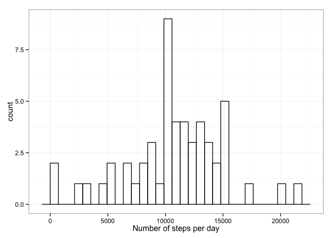
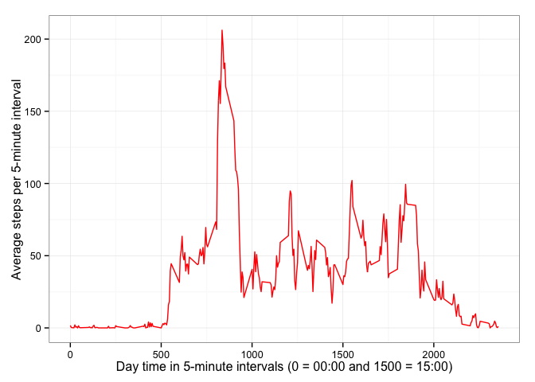
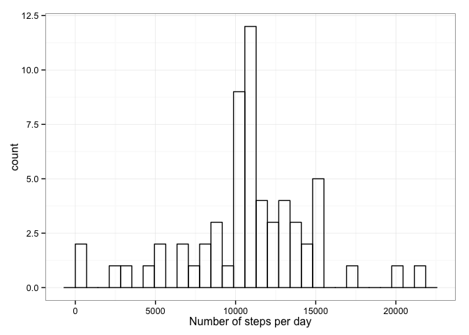
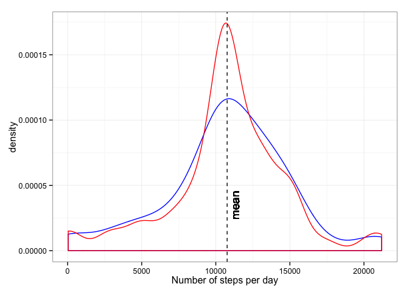
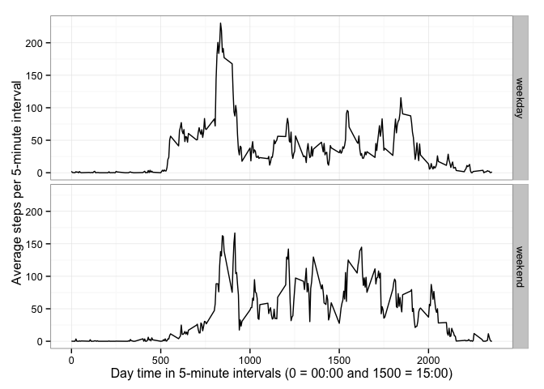

# Reproducible Research: Peer Assessment 1
Dina Ruano @Dec 2014  

Set default chunk options

```r
require(knitr)
opts_chunk$set(echo=TRUE)
options(scipen = 1, digits = 6)
```

Load required packages

```r
library(lubridate) # package that makes working with dates easier
library(dplyr) # package to work with data frame objects
library(ggplot2) # to produce plots
```

Download data

```r
if(!file.exists("repdata-p1-activity.zip")){
fileUrl = "https://d396qusza40orc.cloudfront.net/repdata%2Fdata%2Factivity.zip" 
download.file(fileUrl, destfile = "repdata-p1-activity.zip", method = "curl") # download zip file        
}
```

## Loading and preprocessing the data


```r
mydf<- read.csv(unzip("repdata-p1-activity.zip"), stringsAsFactors = FALSE) # read the data from the downloaded zip file.
mydf$date <- ymd(mydf$date) # tranform the date in a object of class "POSIXct" "POSIXt" using the lubridate package
```

## What is the mean total number of steps taken per day? (Ignore missing values)  
**1.1 Make a histogram of the total number of steps taken each day.**   


```r
# compute the number of steps per day
steps_day <- mydf %>%
             group_by(date) %>%
             summarize(stepsPerDay = sum(steps))

# Produce histogram
ggplot(steps_day, aes(stepsPerDay)) + 
        geom_histogram( fill=NA, color="black") +
        theme_bw() +
        xlab ("Number of steps per day")
```

 
  

**1.2 Calculate and report the mean and median total number of steps taken per day.**

```r
meanStepsDay <- steps_day %>%
                summarize(mean(stepsPerDay, na.rm = TRUE))
meanStepsDay
```

```
## Source: local data frame [1 x 1]
## 
##   mean(stepsPerDay, na.rm = TRUE)
## 1                         10766.2
```

```r
medianStepsDay <- steps_day %>%
                summarize(median(stepsPerDay, na.rm = TRUE))
medianStepsDay
```

```
## Source: local data frame [1 x 1]
## 
##   median(stepsPerDay, na.rm = TRUE)
## 1                             10765
```
The mean and median number of steps per day are respectively 10766, 10765.

## What is the average daily activity pattern?   

**2.1. Make a time series plot (i.e. type = "l") of the 5-minute interval (x-axis) and the average number of steps taken, averaged across all days (y-axis)**


```r
# Compute the average number of steps over all days for each of the 5-minute interval
steps_interval <- mydf %>%
        group_by(interval) %>%
        summarize(stepsPerInterval = mean(steps, na.rm = TRUE))

# Make the plot
ggplot(steps_interval, aes(interval, stepsPerInterval)) + 
        geom_line(color = "red") +
        theme_bw() +
        labs(x = "Day time in 5-minute intervals (0 = 00:00 and 1500 = 15:00)", y = "Average steps per 5-minute interval") 
```

 


**2.2. Which 5-minute interval, on average across all the days in the dataset, contains the maximum number of steps?**  


```r
max_int <- steps_interval %>%
filter(stepsPerInterval == max(stepsPerInterval))
max_int
```

```
## Source: local data frame [1 x 2]
## 
##   interval stepsPerInterval
## 1      835           206.17
```
The maximum number of steps in a 5-minute interval is 206 and is observed at 8:35

## Imputing missing values

**3.1. Calculate and report the total number of missing values in the dataset**


```r
nNA <- mydf %>%
        filter(is.na(steps)) %>%
        summarise(n = n())
nNA
```

```
##      n
## 1 2304
```
The total number of missing values observed is 2304

**3.2. Fill in all of the missing values in the dataset. Create a new dataset that is equal to the original dataset but with the missing data filled in**  
To impute missing values, the mean across all days for the 5-minute interval was used to impute missing values(NA). The implementation was inspired by [this stackoverflow thread](http://stackoverflow.com/questions/21714867/replace-na-in-a-dplyr-chain)


```r
imputedData <- mydf %>%
               group_by(interval) %>%
               mutate(steps = ifelse(is.na(steps), mean(steps, na.rm = TRUE), steps))
```

**3.3. Make a histogram of the total number of steps taken each day** 

```r
# Compute the number of steps per day
steps_day2 <- imputedData %>%
             group_by(date) %>%
             summarize(stepsPerDay = sum(steps))

# produce histogram
ggplot(steps_day2, aes(stepsPerDay)) + 
        geom_histogram( fill=NA, color="black") +
        theme_bw() +
        xlab ("Number of steps per day")
```

 

**3.4. Calculate the mean and median total number of steps taken per day**

```r
meanStepsDay2 <- steps_day2 %>%
                summarize(mean(stepsPerDay, na.rm = TRUE))
meanStepsDay2
```

```
## Source: local data frame [1 x 1]
## 
##   mean(stepsPerDay, na.rm = TRUE)
## 1                         10766.2
```

```r
medianStepsDay2 <- steps_day2 %>%
                summarize(median(stepsPerDay, na.rm = TRUE))
medianStepsDay2
```

```
## Source: local data frame [1 x 1]
## 
##   median(stepsPerDay, na.rm = TRUE)
## 1                           10766.2
```
The mean and median total number of steps taken per day, after imputing missing values, are respectively 10766 and 10766.


**3.5 Do these values differ from the estimates from the first part of the assignment?**


```r
cat("| Missing values       | ignored | imputed |", "| -------------------- | ------- | ------- |", paste0 ("| Mean steps per day   |  ", round(meanStepsDay,0) ,"  |  ", round(meanStepsDay2,0), "  |"), paste0 ("| Median steps per day |  ", round(medianStepsDay,0) ,"  |  ", round(medianStepsDay2,0), "  |"), sep="\n")
```

```
| Missing values       | ignored | imputed |
| -------------------- | ------- | ------- |
| Mean steps per day   |  10766  |  10766  |
| Median steps per day |  10765  |  10766  |
```
Only a small differnce is observed in the median. Mean value is the same before and after imputation.

**3.6 What is the impact of imputing missing data on the estimates of the total daily number of steps?**

```r
mergeData <- cbind(steps_day, steps_day2)
colnames(mergeData) <-c("date", "withNA", "date2", "withoutNA")
ggplot(mergeData, aes(withNA)) + 
        geom_density(color="blue") +
        geom_density(aes(withoutNA), color="red") +
        theme_bw() +
        geom_vline(xintercept = as.numeric(meanStepsDay2), linetype=2, color = "black", label = "mean") +
        geom_text(aes(x=as.numeric(meanStepsDay2), label="mean", y=0.000035), colour="black", angle=90, vjust = 1.5, text=element_text(size=4)) +
        xlab("Number of steps per day")
```

```
## Warning: Removed 8 rows containing non-finite values (stat_density).
```

 
  
Increases the frequency of observations close to the mean number of steps per day.

## Are there differences in activity patterns between weekdays and weekends?  
Use the dataset with the filled-in missing values for this part.

**4.1 Create a new factor variable in the dataset with two levels -- "weekday" and "weekend" indicating whether a given date is a weekday or weekend day.**  


```r
imputedData$day <- ifelse((wday(imputedData$date) %in% c(1,7)), "weekend", "weekday")
```

**4.2 Make a panel plot containing a time series plot (i.e. type = "l") of the 5-minute interval (x-axis) and the average number of steps taken, averaged across all weekday days or weekend days (y-axis).**

```r
# Compute the average number of steps for each of the 5-minute interval for week and weekend days separated
steps_interval2 <- imputedData %>%
        group_by(interval, day) %>%
        summarize(stepsPerInterval = mean(steps, na.rm = TRUE))

# make panel plot
ggplot(steps_interval2, aes(interval, stepsPerInterval)) + 
        geom_line() +
        facet_grid(day ~ .) +
        theme_bw() +
        labs(x = "Day time in 5-minute intervals (0 = 00:00 and 1500 = 15:00)", y = "Average steps per 5-minute interval") 
```

 

